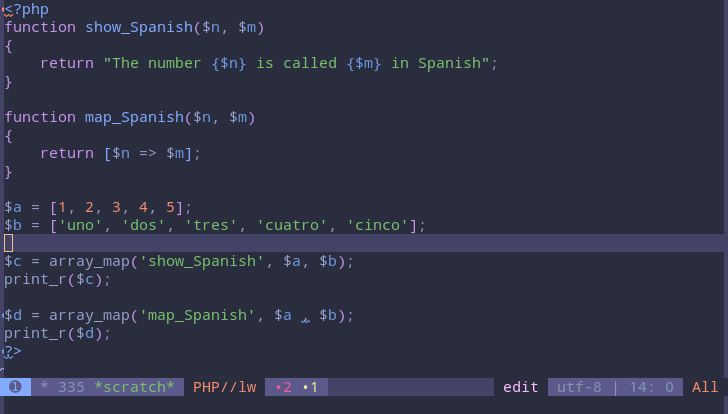

# base16-katy-scheme

Katy is a dark color theme for [base16](https://github.com/chriskempson/base16) that was inspired by
[Palenight](https://github.com/whizkydee/vscode-palenight-theme) and
[Zerodark](https://github.com/NicolasPetton/zerodark-theme).  This theme is named after the
[Katy Trail](https://en.wikipedia.org/wiki/Katy_Trail_State_Park) in
[Missouri](https://en.wikipedia.org/wiki/Missouri).

I am a big fan of the Palenight theme and absolutely love the dark purple background color and the
soft white text color. I started with the colors from the
[base16 material palenight](https://github.com/ntpeters/base16-materialtheme-scheme) theme, kept the
background and text colors and changed the variable color from red to blue. Next, I tweaked colors
to make them more distinct. In the end 5 of the 16 original colors changed, and the result looks
like a blend between Palenight and Zerodark.

## Katy base16 colors:

## Examples

### JavaScript

### PHP

### Haskell

